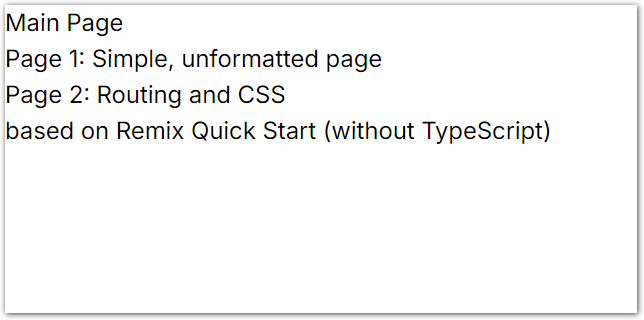
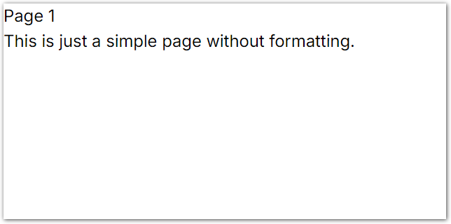
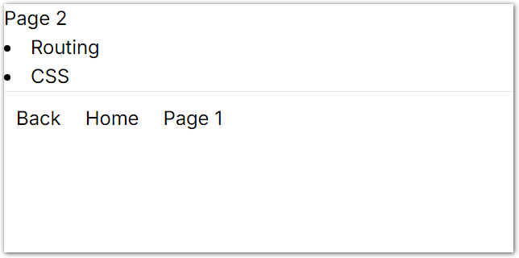

# Simple Remix Getting Started React App

Just a simple project to take a look at [Remix](https://remix.run). Based on the [Quick Start](https://remix.run/docs/en/main/start/quickstart) app (without TypeScript).

Run `npm run dev` and open http://localhost:5173.

